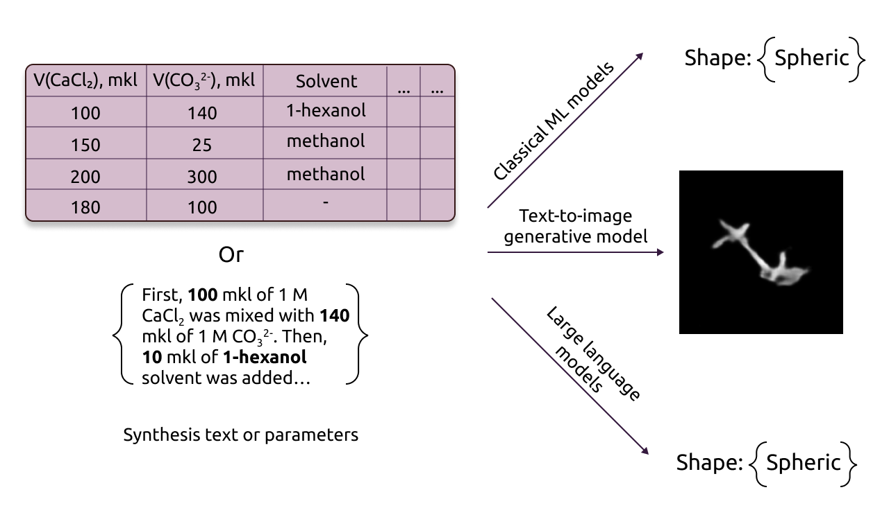

# Unveiling the Potential of AI for Nanomaterial Morphology Prediction

Creation of nanomaterials with specific morphology remains a complex experimental process, even though there is a growing demand for these materials in various industry sectors. This study explores the potential of AI to predict the morphology of nanoparticles within the data availability constraints. 

For that, we first generated a new multi-modal dataset that is double the size of analogous studies. Then, we systematically evaluated performance of classical machine learning and large language models in prediction of nanomaterial shapes and sizes. Finally, we prototyped a text-to-image system, discussed the obtained empirical results, as well as the limitations and promises of existing approaches.

## Folders

- Classical_ML - This folder contains the code to run a pipline to calculate the prediction accuracies of classical machine learning models. The code is launched through classification_results.ipynb. The folder also contains the results in the corresponding .csv files, in particular for different test and training splits. Checkpoints for each model are also in the corresponding folders.
- Dataset - This folder contains the original labeled and unlabeled dataset, templates for texts of syntheses, and original scanning electron microscope images of nanomaterials. Also here is one of the augmented datasets for building text-to-image models, but the other datasets used in text-to-image can be obtained using the original one using scripts for ImageJ.
- Feature_selection - This folder contains a notebook for performing statistical tests and data analysis on a tabular dataset.
- ImageJ_scripts - Here are scripts for ImageJ that allow you to segment your source images (Segmentation.ijm), then augment them by adding different variations in brightness and sharpness (Augmentations.ijm), and add rotations (Rotations.ijm).
- LLM_dataset_preparation - Here is a notebook for preparing the dataset for use by large language models, as well as the results of predictions using LLM. The code itself for using large language models is here: https://github.com/acid-design-lab/LLM_classifier
- Linking_AE_training - This folder contains the training pipelines of the linking VAE used to trasform text embeddings into image embeddings. Due to the large size, checkpoints for this model are not presented, but can be obtained by training.
- Text_embedding_predictions - This folder contains a pipeline of nanomaterial shape predictions from textual embeddings of synthesis procedures derived from the BERT model.
- Text_to_image_inference - This folder contains code to generate new images using text-to-image models, but the checkpoints of all models are not represented due to their large size, so they can be re-trained on existing datasets. Also examples of generation for one of the models are presented .
- VAE_training - This folder contains the pipelines for training VAE to compress images into vector representations, whose decoder is used to generate them. Due to the large size, checkpoints for this model are not presented, but can be obtained by training.

## Installation

To install all necessary packages with conda use the following command:

`conda env export > environment.yml`

## Results

The predictions results for classical machine learning models and for large language models are in the files results_ml.xlsx and results_llm.xlsx, respectively.

Summary of the results you can also see here:

| **Shape** | **# samples** | **Accuracy** | **F1 score** |
|-----------|---------------|--------------|--------------|
| Cube      | 140           | 0.76 ± 0.02  | 0.73 ± 0.03  |
| Stick     | 84            | 0.78 ± 0.01  | 0.77 ± 0.01  |
| Sphere    | 40            | 0.82 ± 0.06  | 0.67 ± 0.08  |
| Flat      | 16            | 0.82 ± 0.11  | 0.52 ± 0.09  |
| Amorphous | 34            | 0.80 ± 0.02  | 0.62 ± 0.04  |
| Average   |               | 0.80 ± 0.04  | 0.66 ± 0.05  |

*Prediction of shapes with classical ML models. Top average accuracy and F1 scores achieved by the Random Forest classifiers on the test set.*

$~$

| **Shape**        | **Mistral-medium** | **Mistral-small** | **Mistral-tiny** | **GPT-3.5-turbo** | **GPT-4**     | **GPT-4-turbo** |
|------------------|--------------------|-------------------|------------------|-------------------|---------------|-----------------|
| Cube             | 0.70±0.11          | **0.76±0.08**     | 0.76±0.19        | 0.69±0.18         | 0.71±0.05     | 0.60±0.15       |
| Stick            | **0.71±0.04**      | 0.67±0.11         | 0.71±0.10        | 0.62±0.16         | 0.68±0.05     | 0.61±0.13       |
| Sphere           | 0.38±0.12          | 0.77±0.18         | 0.62±0.24        | 0.63±0.15         | **0.88±0.05** | 0.44±0.12       |
| Flat             | 0.89±0.08          | **0.92±0.07**     | 0.81±0.17        | 0.90±0.06         | 0.90±0.10     | 0.91±0.06       |
| Amorphous        | 0.70±0.15          | 0.88±0.08         | 0.53±0.16        | 0.80±0.13         | 0.87±0.12     | **0.88±0.08**   |
| Average accuracy | 0.68±0.10          | 0.80±0.10         | 0.69±0.17        | 0.73±0.13         | **0.81±0.07** | 0.69±0.11       |

*Top performance achieved by the LLMs in prediction of nanomaterial shapes. Average accuracy corresponds to the following prompting strategy: only target classes in prompt, syntheses presented in the textual format, number of training examples N=8. Only accuracy is given since the corresponding data is balanced.*
